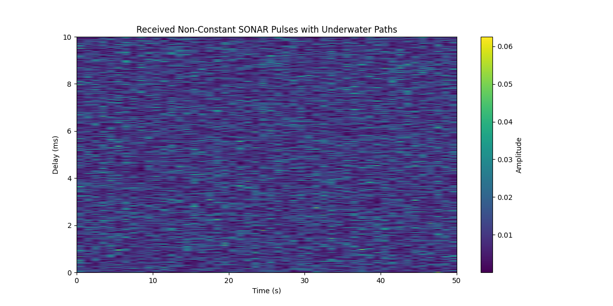
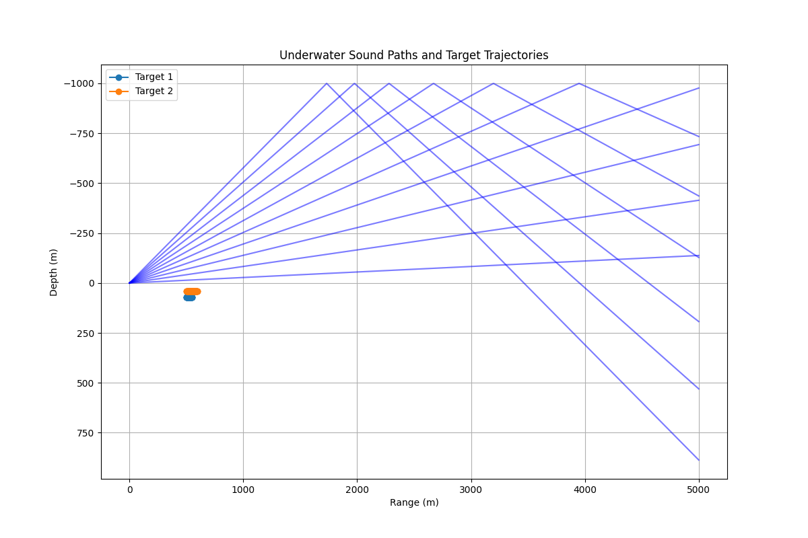

# Experiments with Non-Linear Transformations for Object Tracking

## Introduction

This project involves a basic simulation for underwater object tracking using SONAR technology and the Unscented Kalman Filter (UKF). It is part of ongoing experiments with non-linear transformations for state estimation and object tracking. The project includes a simulation environment, SONAR pulse generation, and filtering techniques.

### Project Objectives

The main objectives are:
- Create a simulation environment for underwater target tracking.
- Generate and process SONAR signals to estimate target positions.
- Implement and tune the UKF for state estimation.
- Analyze the performance of the UKF in tracking accuracy.

### Simulation Environment

The simulation involves an active SONAR system with two moving targets. Parameters such as maximum depth, range, and sound speed profile are set to create a realistic environment. The simulation tracks target movement, generates SONAR pulses, and processes the returns.

### SONAR Pulse Generation

A frequency-modulated pulse is generated, propagated through the underwater environment, and reflected back to the receiver. The simulation accounts for factors like attenuation, Doppler effects, and noise.

### State Estimation with Unscented Kalman Filter

The UKF estimates the state of the targets based on noisy SONAR measurements. It is initialized with specific process noise covariance (`Q`), measurement noise covariance (`R`), and initial state covariance (`P`). These parameters are tuned for optimal performance.
## Results

### UKF Tracking Results

The UKF closely follows the actual path of the target, indicating accurate tracking performance.


### Received SONAR Pulses

The received SONAR pulses over time show consistent patterns and variations in amplitude, reflecting different signal strengths.



### Underwater Sound Paths and Target Trajectories

The sound paths and the actual trajectories of the targets highlight the reflection patterns and realistic movement within the simulation environment.



### Tuning Results

The following table shows the tuning results for different scales of process noise covariance (`Q`), measurement noise covariance (`R`), and initial state covariance (`P`), along with the corresponding estimation errors:

```plaintext
Q scale: 0.001, R scale: 0.01, P scale: 1, Error: 13.24 meters
Q scale: 0.001, R scale: 0.01, P scale: 5, Error: 16.22 meters
Q scale: 0.001, R scale: 0.01, P scale: 10, Error: 20.52 meters
Q scale: 0.001, R scale: 0.01, P scale: 20, Error: 30.11 meters
Q scale: 0.001, R scale: 0.05, P scale: 1, Error: 9.29 meters
Q scale: 0.001, R scale: 0.05, P scale: 5, Error: 12.96 meters
Q scale: 0.001, R scale: 0.05, P scale: 10, Error: 13.79 meters
Q scale: 0.001, R scale: 0.05, P scale: 20, Error: 14.85 meters
Q scale: 0.001, R scale: 0.1, P scale: 1, Error: 7.14 meters
Q scale: 0.001, R scale: 0.1, P scale: 5, Error: 11.67 meters
Q scale: 0.001, R scale: 0.1, P scale: 10, Error: 12.83 meters
Q scale: 0.001, R scale: 0.1, P scale: 20, Error: 13.52 meters
Q scale: 0.001, R scale: 0.2, P scale: 1, Error: 5.37 meters
Q scale: 0.001, R scale: 0.2, P scale: 5, Error: 9.85 meters
Q scale: 0.001, R scale: 0.2, P scale: 10, Error: 11.57 meters
Q scale: 0.001, R scale: 0.2, P scale: 20, Error: 12.60 meters
Q scale: 0.005, R scale: 0.01, P scale: 1, Error: 14.16 meters
Q scale: 0.005, R scale: 0.01, P scale: 5, Error: 16.93 meters
Q scale: 0.005, R scale: 0.01, P scale: 10, Error: 21.15 meters
Q scale: 0.005, R scale: 0.01, P scale: 20, Error: 30.64 meters
Q scale: 0.005, R scale: 0.05, P scale: 1, Error: 9.70 meters
Q scale: 0.005, R scale: 0.05, P scale: 5, Error: 13.15 meters
Q scale: 0.005, R scale: 0.05, P scale: 10, Error: 13.95 meters
Q scale: 0.005, R scale: 0.05, P scale: 20, Error: 15.00 meters
Q scale: 0.005, R scale: 0.1, P scale: 1, Error: 7.43 meters
Q scale: 0.005, R scale: 0.1, P scale: 5, Error: 11.79 meters
Q scale: 0.005, R scale: 0.1, P scale: 10, Error: 12.92 meters
Q scale: 0.005, R scale: 0.1, P scale: 20, Error: 13.60 meters
Q scale: 0.005, R scale: 0.2, P scale: 1, Error: 5.55 meters
Q scale: 0.005, R scale: 0.2, P scale: 5, Error: 9.94 meters
Q scale: 0.005, R scale: 0.2, P scale: 10, Error: 11.63 meters
Q scale: 0.005, R scale: 0.2, P scale: 20, Error: 12.65 meters
Q scale: 0.01, R scale: 0.01, P scale: 1, Error: 15.24 meters
Q scale: 0.01, R scale: 0.01, P scale: 5, Error: 17.79 meters
Q scale: 0.01, R scale: 0.01, P scale: 10, Error: 21.91 meters
Q scale: 0.01, R scale: 0.01, P scale: 20, Error: 31.28 meters
Q scale: 0.01, R scale: 0.05, P scale: 1, Error: 10.19 meters
Q scale: 0.01, R scale: 0.05, P scale: 5, Error: 13.39 meters
Q scale: 0.01, R scale: 0.05, P scale: 10, Error: 14.16 meters
Q scale: 0.01, R scale: 0.05, P scale: 20, Error: 15.18 meters
Q scale: 0.01, R scale: 0.1, P scale: 1, Error: 7.78 meters
Q scale: 0.01, R scale: 0.1, P scale: 5, Error: 11.95 meters
Q scale: 0.01, R scale: 0.1, P scale: 10, Error: 13.04 meters
Q scale: 0.01, R scale: 0.1, P scale: 20, Error: 13.70 meters
Q scale: 0.01, R scale: 0.2, P scale: 1, Error: 5.77 meters
Q scale: 0.01, R scale: 0.2, P scale: 5, Error: 10.05 meters
Q scale: 0.01, R scale: 0.2, P scale: 10, Error: 11.71 meters
Q scale: 0.01, R scale: 0.2, P scale: 20, Error: 12.71 meters
Q scale: 0.02, R scale: 0.01, P scale: 1, Error: 17.17 meters
Q scale: 0.02, R scale: 0.01, P scale: 5, Error: 19.41 meters
Q scale: 0.02, R scale: 0.01, P scale: 10, Error: 23.37 meters
Q scale: 0.02, R scale: 0.01, P scale: 20, Error: 32.54 meters
Q scale: 0.02, R scale: 0.05, P scale: 1, Error: 11.09 meters
Q scale: 0.02, R scale: 0.05, P scale: 5, Error: 13.85 meters
Q scale: 0.02, R scale: 0.05, P scale: 10, Error: 14.55 meters
Q scale: 0.02, R scale: 0.05, P scale: 20, Error: 15.54 meters
Q scale: 0.02, R scale: 0.1, P scale: 1, Error: 8.45 meters
Q scale: 0.02, R scale: 0.1, P scale: 5, Error: 12.25 meters
Q scale: 0.02, R scale: 0.1, P scale: 10, Error: 13.28 meters
Q scale: 0.02, R scale: 0.1, P scale: 20, Error: 13.90 meters
Q scale: 0.02, R scale: 0.2, P scale: 1, Error: 6.20 meters
Q scale: 0.02, R scale: 0.2, P scale: 5, Error: 10.28 meters
Q scale: 0.02, R scale: 0.2, P scale: 10, Error: 11.87 meters
Q scale: 0.02, R scale: 0.2, P scale: 20, Error: 12.83 meters
Q scale: 0.05, R scale: 0.01, P scale: 1, Error: 21.75 meters
Q scale: 0.05, R scale: 0.01, P scale: 5, Error: 23.66 meters
Q scale: 0.05, R scale: 0.01, P scale: 10, Error: 27.32 meters
Q scale: 0.05, R scale: 0.01, P scale: 20, Error: 35.95 meters
Q scale: 0.05, R scale: 0.05, P scale: 1, Error: 13.36 meters
Q scale: 0.05, R scale: 0.05, P scale: 5, Error: 15.14 meters
Q scale: 0.05, R scale: 0.05, P scale: 10, Error: 15.69 meters
Q scale: 0.05, R scale: 0.05, P scale: 20, Error: 16.58 meters
Q scale: 0.05, R scale: 0.1, P scale: 1, Error: 10.21 meters
Q scale: 0.05, R scale: 0.1, P scale: 5, Error: 13.12 meters
Q scale: 0.05, R scale: 0.1, P scale: 10, Error: 13.95 meters
Q scale: 0.05, R scale: 0.1, P scale: 20, Error: 14.48 meters
Q scale: 0.05, R scale: 0.2, P scale: 1, Error: 7.42 meters
Q scale: 0.05, R scale: 0.2, P scale: 5, Error: 10.91 meters
Q scale: 0.05, R scale: 0.2, P scale: 10, Error: 12.32 meters
Q scale: 0.05, R scale: 0.2, P scale: 20, Error: 13.17 meters


### Best Parameters

The best parameters achieved through tuning are:
- **Q (Process Noise Covariance):**

  ```plaintext
  [[0.001 0.    0.    0.   ]
   [0.    0.001 0.    0.   ]
   [0.    0.    0.001 0.   ]
   [0.    0.    0.    0.001]]


R (Measurement Noise Covariance): [[0.2]]

P (Initial State Covariance):
[[1. 0. 0. 0.]
 [0. 1. 0. 0.]
 [0. 0. 1. 0.]
 [0. 0. 0. 1.]]
